# Network Intrusion Detection System (IDS) Simulation

> A defensive Python-based network intrusion detection prototype that analyzes synthetic network-flow records using rule-based detection, statistical anomaly scoring, hybrid risk classification, optional machine-learning scoring, alert investigation, and a Streamlit dashboard.

---

## Author

**Adarsh Srivastav**

Cybersecurity | Network Security | Python | Machine Learning

---

## Project Overview

The **Network Intrusion Detection System (IDS) Simulation** is an educational, defensive cybersecurity project. It generates safe synthetic network-flow data, evaluates each flow with detection rules and anomaly scoring, assigns a risk classification, and records alerts for investigation.

The FastAPI backend stores flow and alert records in a local SQLite database. The Streamlit dashboard presents operational metrics, alert details, analytics, and report exports.

The project is intended for local learning and demonstration. It uses synthetic records; it does not capture live network traffic, scan external systems, or perform attacks.

---

## Objectives

- Generate reproducible, synthetic network-flow records.
- Extract flow features for security analysis.
- Detect suspicious behavior with configurable rules.
- Score unusual activity against a statistical baseline.
- Combine rule, anomaly, and optional ML signals into a risk classification.
- Store flows, alerts, statuses, and investigation notes locally.
- Present monitoring and investigation workflows in a browser dashboard.
- Provide CSV and JSON alert-report exports.
- Demonstrate defensive IDS concepts in a safe local environment.

---

## Key Features

- Synthetic normal and suspicious traffic scenarios
- Rule-based detection for:
  - Excessive connection rate
  - Repeated failed connections
  - High destination-port diversity
  - SYN-heavy connection behavior
  - Abnormally high traffic volume
- Statistical anomaly scoring for flow behavior
- Hybrid risk score and classification
- Optional scikit-learn model probability scoring
- FastAPI endpoints for flows, alerts, rules, and dashboard statistics
- SQLite persistence for network flows, alerts, and investigation notes
- Streamlit dashboard with Overview, Alert Investigation, Threat Analytics, and Reports tabs
- Alert status updates and investigation notes
- CSV and JSON report downloads
- Synthetic traffic generator and sample dataset
- Unit tests for IDS logic

---

## System Architecture

```text
Synthetic Traffic Generator / Flow Input
                    |
                    v
          Feature Extraction
                    |
        +-----------+-----------+
        |                       |
        v                       v
   Rule Engine            Anomaly Detector
        |                       |
        +-----------+-----------+
                    |
        Optional ML Probability
                    |
                    v
          Hybrid Risk Scoring
                    |
                    v
          Alert Generation
                    |
                    v
         SQLite Local Database
                    |
          +---------+---------+
          |                   |
          v                   v
      FastAPI API        Streamlit Dashboard
                              |
            Overview / Investigation / Analytics / Reports
```

---

## Detection Workflow

```text
Generate or submit a synthetic flow
                    |
                    v
       Extract network-flow features
                    |
                    v
      Evaluate configured detection rules
                    |
                    v
     Calculate statistical anomaly score
                    |
                    v
     Optionally score with trained ML model
                    |
                    v
         Calculate hybrid risk score
                    |
                    v
      Persist flow and generated alert
                    |
                    v
     Review and triage in the dashboard
```

---

## Detection Components

### Rule-Based Detection

The rule engine checks flow features against thresholds to identify high connection rates, repeated failures, port diversity, SYN-heavy behavior, and unusually high traffic volume.

### Anomaly Detection

The anomaly detector compares selected flow measurements with a baseline derived from the synthetic dataset when available, otherwise using built-in default baseline values.

### Risk Scoring and Optional ML

The risk engine combines rule hits, anomaly score, and—when a trained model file is present—an optional ML probability. The final result includes a risk score and classification.

The ML model is optional. The API runs without it, and model training is a separate step.

### Alert Investigation

Generated alerts contain flow context, severity, anomaly and risk scores, a description, and an investigation status. Analysts can change an alert's status and add notes through the dashboard.

---

## Technologies

| Area | Technology |
|---|---|
| Language | Python |
| API | FastAPI |
| API server | Uvicorn |
| Dashboard | Streamlit |
| Data processing | pandas, NumPy |
| Optional ML | scikit-learn, joblib |
| Charts | Plotly |
| Persistence | SQLite |
| Tests | Python `unittest` |

---

## Project Structure

```text
Network-Intrusion-Detection-System-IDS-Simulation/
├── backend/
│   ├── __init__.py
│   └── app.py
├── dashboard/
│   └── app.py
├── data/
│   └── network_traffic.csv
├── ids/
│   ├── __init__.py
│   ├── alert_engine.py
│   ├── anomaly_detector.py
│   ├── feature_extractor.py
│   ├── risk_engine.py
│   └── rule_engine.py
├── ml/
│   ├── __init__.py
│   ├── evaluate.py
│   └── train_model.py
├── simulator/
│   ├── __init__.py
│   ├── generate_dataset.py
│   └── traffic_simulator.py
├── tests/
│   ├── __init__.py
│   └── test_ids.py
├── models/                 # Optional locally trained model (git-ignored)
├── .env.example
├── .gitignore
├── README.md
└── requirements.txt
```

The SQLite database and temporary live-traffic CSV are created locally and are excluded from Git.

---

## Requirements

- Python 3.10 or newer recommended
- pip
- Windows, macOS, or Linux

---

## Installation and Run

Run each command from the project root.

### 1. Create and activate a virtual environment

**Windows PowerShell**

```powershell
py -m venv .venv
.\.venv\Scripts\Activate.ps1
```

**macOS / Linux**

```bash
python3 -m venv .venv
source .venv/bin/activate
```

### 2. Install dependencies

```bash
python -m pip install -r requirements.txt
```

### 3. Generate a synthetic dataset (optional)

```bash
python simulator/generate_dataset.py --count 5000 --output data/network_traffic.csv
```

The repository already includes a small synthetic example dataset.

### 4. Train the optional ML model (optional)

```bash
python ml/train_model.py --dataset data/network_traffic.csv --output models/ids_model.joblib
```

The generated model is a local artifact and is not included in the repository.

### 5. Start the API

In a terminal from the project root:

```bash
python -m uvicorn backend.app:app --host 127.0.0.1 --port 8000
```

Check API health at `http://127.0.0.1:8000/health` and interactive API documentation at `http://127.0.0.1:8000/docs`.

### 6. Start the dashboard

In a second terminal from the project root:

```bash
streamlit run dashboard/app.py
```

Open the local URL printed by Streamlit (normally `http://localhost:8501`).

### 7. Generate synthetic live-flow records (optional)

```bash
python simulator/traffic_simulator.py --mode mixed --speed slow --duration 30 --output data/live_traffic.csv
```

This simulator writes synthetic records to a CSV file. It does not submit them to the API automatically.

---

## API Endpoints

| Method | Endpoint | Purpose |
|---|---|---|
| `GET` | `/health` | Check API health |
| `POST` | `/api/flows` | Analyze and store one flow |
| `GET` | `/api/flows` | List stored flows |
| `GET` | `/api/alerts` | List alerts |
| `PUT` | `/api/alerts/{alert_id}/status` | Update alert status and optionally add a note |
| `POST` | `/api/alerts/{alert_id}/notes` | Add an investigation note |
| `GET` | `/api/dashboard/stats` | Read dashboard summary statistics |
| `GET` | `/api/dashboard/traffic` | Read daily flow totals |
| `GET` | `/api/dashboard/alerts` | Read recent alerts |
| `GET` | `/api/rules` | List detection rules |

---

## Dashboard

The Streamlit dashboard provides four views:

1. **Overview** — summary metrics, alert severity distribution, alert types, and recent alerts.
2. **Alert Investigation** — selected alert details, status updates, and analyst notes.
3. **Threat Analytics** — severity and risk-score charts, plus traffic trends when flow data is available.
4. **Reports** — filtered operational summary with CSV and JSON download buttons.

The sidebar also includes controls to generate a sample dataset, train the optional model, and start the synthetic traffic generator.

---

## Testing

Run the unit tests from the project root:

```bash
python -m unittest discover -s tests -v
```

---

## Screenshot Evidence

Capture the screenshots from the running local dashboard. Save approved screenshots in a `screenshots/` folder at the project root using the filenames below. These images are intended to explain and verify distinct parts of the IDS workflow, not just show that the application opens.

Use synthetic demo data only. Maximize the browser, use a consistent zoom level, and arrange each view so its heading and relevant evidence are readable. Avoid unnecessary desktop clutter, open menus, loading states, and personal information. Do not alter values or edit screenshots in a way that changes what the application displayed.

The portfolio evidence set below documents the interface, detection and response workflow, backend, implementation, sample data, and tests—not just that the dashboard opens. Each caption states what the screenshot demonstrates. The screenshots use synthetic data; do not interpret them as evidence of real-world attack traffic or production deployment.

### Dashboard and analyst workflow

#### 1. Dashboard overview

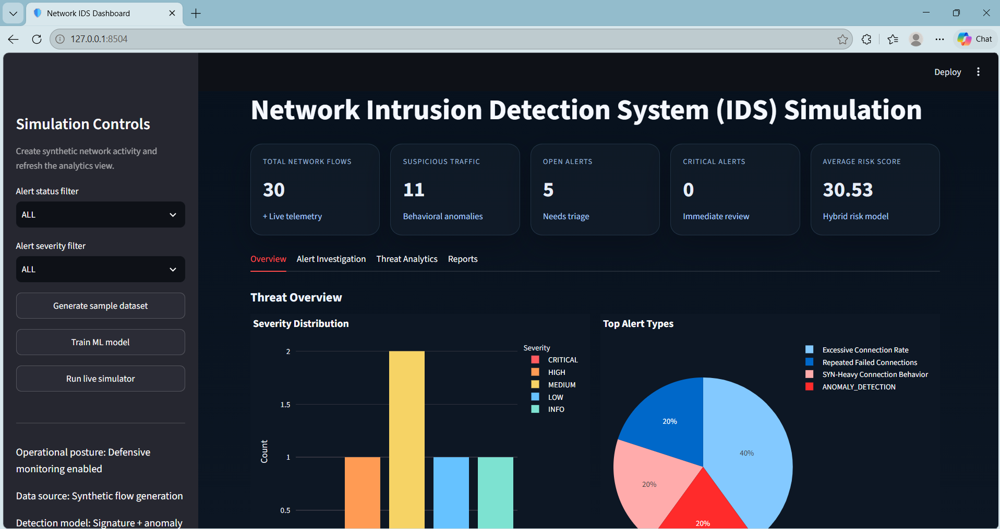

The dashboard displays its project heading, summary metrics, filters, and overview charts, demonstrating the IDS monitoring interface with synthetic results.

#### 2. Alert detection evidence

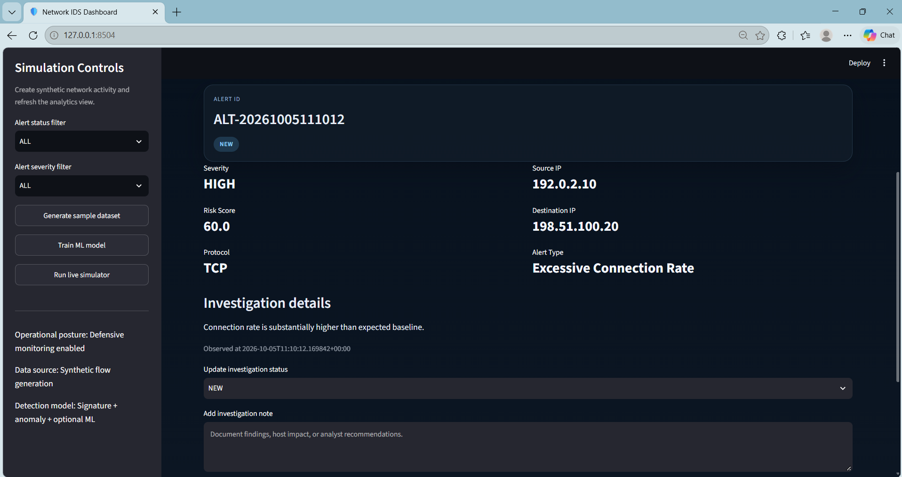

The selected synthetic alert shows its severity, risk score, endpoints, alert type, and explanation, making the reason for analyst review visible.

#### 3. Triage in progress

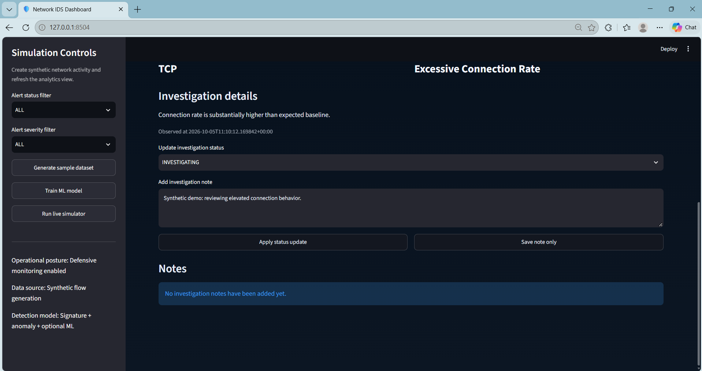

The `INVESTIGATING` selection and illustrative analyst note demonstrate how an analyst can prepare a triage update.

#### 4. Saved triage result

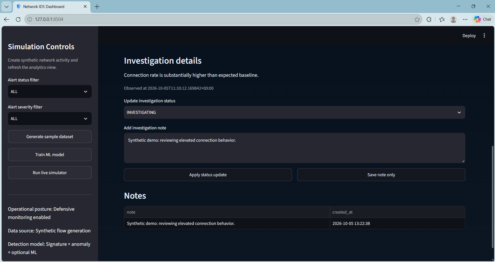

The updated status and saved note in the Notes table show the investigation action persisted in the application.

#### 5. Threat analytics

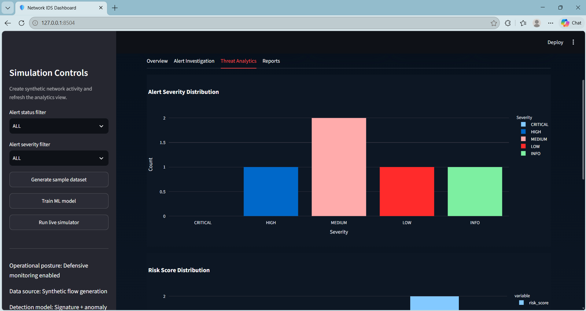

The severity distribution demonstrates how alerts can be reviewed in aggregate, beyond examining a single event.

#### 6. Operational report

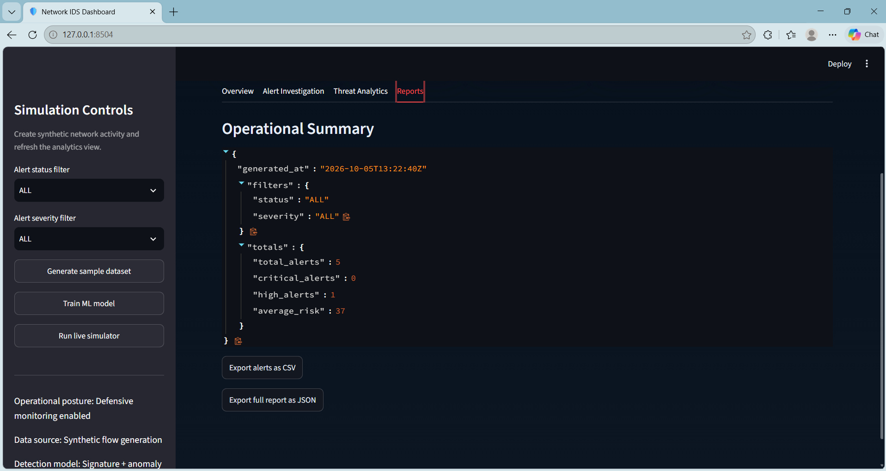

The operational summary and CSV/JSON export controls demonstrate the dashboard's reporting workflow.

### Backend and implementation

#### 7. API documentation

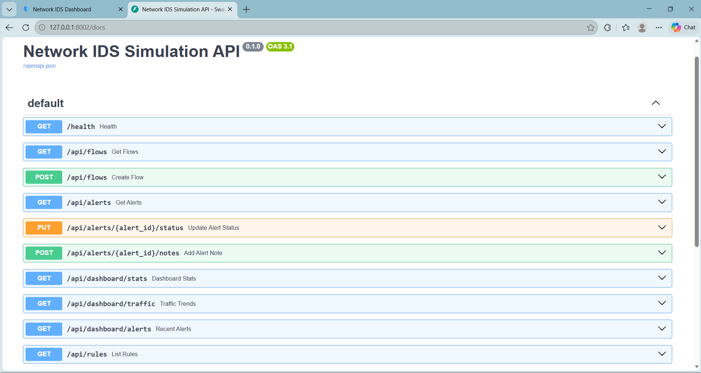

The FastAPI documentation lists the IDS routes, demonstrating the backend's browsable API surface.

#### 8. API health check

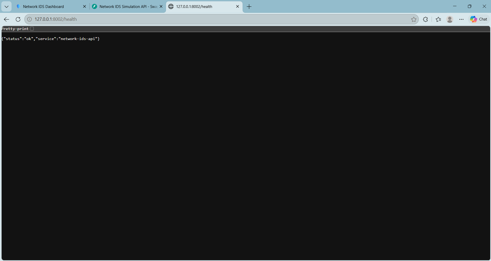

The successful `/health` response verifies that the local API endpoint was reachable when captured.

#### 9. Detection rules source

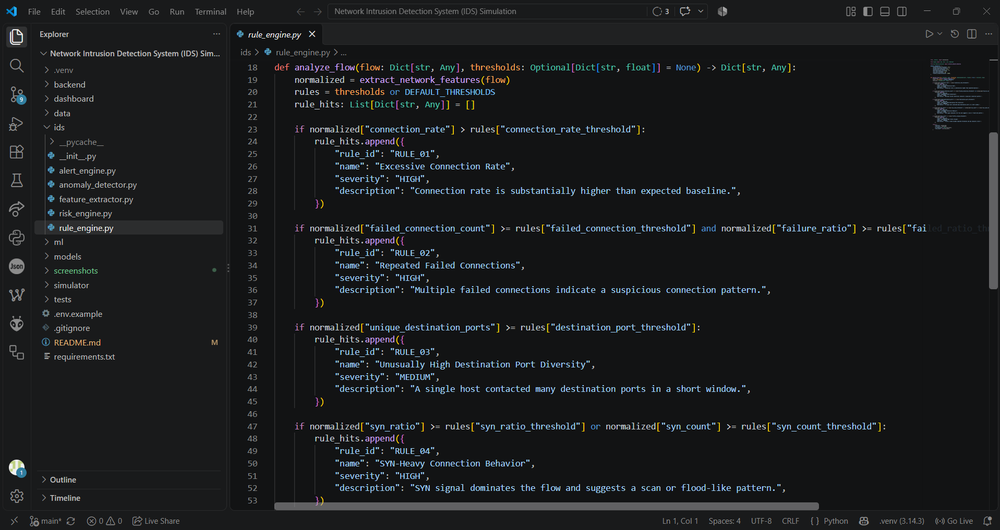

The rule-engine implementation shows the source code for the project's connection-rate, failed-connection, port-diversity, and SYN-based checks.

#### 10. Unit tests

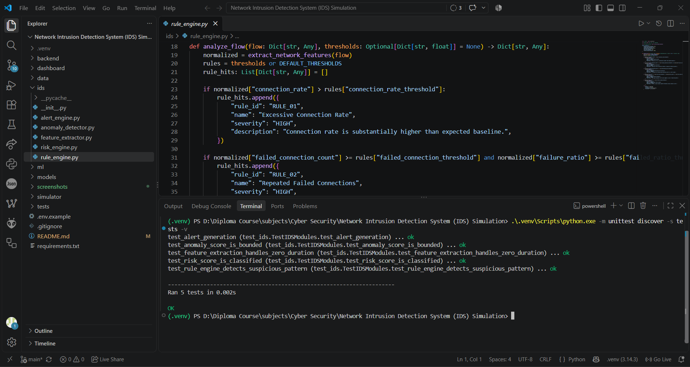

The terminal output shows the project test command completing with five tests passing.

#### 11. Synthetic sample data

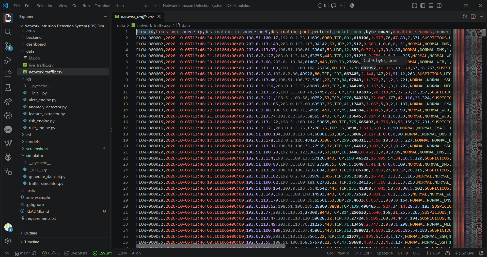

The CSV view shows example flow records, labels, and documentation-range IP addresses used by the local simulation.

#### 12. Synthetic data generator

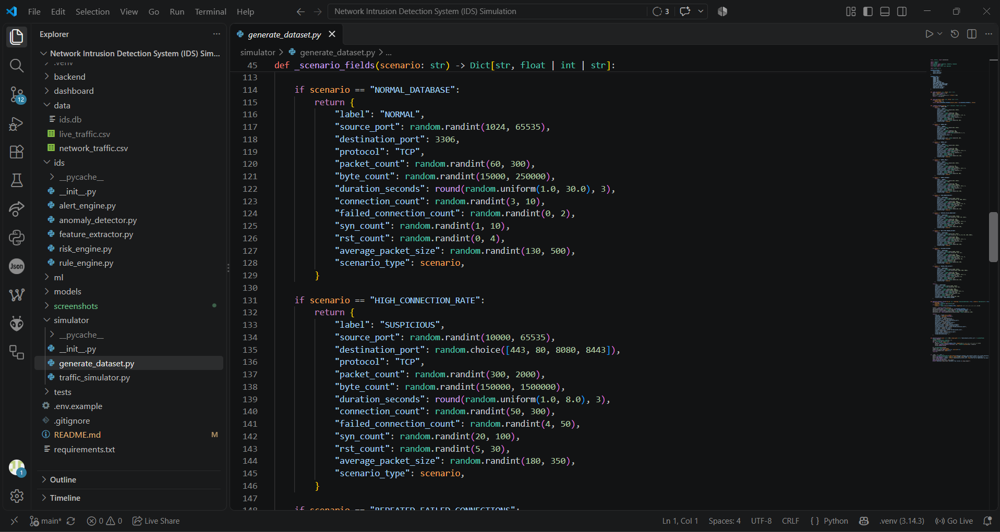

The generator implementation shows how normal and suspicious scenarios are constructed for safe IDS demonstrations.

For demonstration notes, use clearly labeled synthetic examples such as `Synthetic demo: reviewing elevated connection behavior.` Do not include real incident details or personal data. Source-code and test screenshots should show the actual project files and genuine command output; do not edit or fabricate evidence.

### Screenshot review checklist

- The correct project page or API endpoint is visible.
- The screenshot clearly supports the stated purpose in the table.
- Headings, metric values, alert details, and charts are legible at normal zoom.
- The screenshot does not show a loading error, traceback, or unrelated page.
- The selected filters do not unintentionally hide the evidence.
- The capture contains no credentials or private information.
- The screenshot is an unaltered capture of the running application.

---

## Results

The application demonstrates a local end-to-end IDS workflow: synthetic flow generation, feature extraction, rule and anomaly analysis, optional ML scoring, risk classification, alert persistence, and analyst-facing dashboard views.

Dashboard charts and alert views depend on records being present in the local SQLite database. The sample CSV is available for generation/training workflows, but is not automatically imported into the dashboard database.

---

## Security and Ethics

This project is for defensive learning and demonstration. It uses synthetic flow records and does not perform network scanning, packet capture, exploitation, or attacks. Keep testing local and use only data you are authorized to process.

---

## Limitations

- The system analyzes flow records; it is not a packet-capture sensor.
- The bundled traffic is synthetic and is not representative of all real networks.
- Detection thresholds and statistical baselines are illustrative and may need tuning.
- ML scoring is optional and requires a locally trained model.
- The dashboard reads the local SQLite database; generating a CSV alone does not populate it.
- This prototype is not a production SIEM or a substitute for a deployed IDS.

---

## Future Scope

- Import safe, authorized Zeek or Suricata flow/log data.
- Add configurable rule management and threshold validation.
- Improve alert correlation and analyst workflow.
- Add authentication and role-based access for shared deployments.
- Add containerized local deployment and automated integration tests.
- Extend model evaluation and document performance on controlled datasets.

---

## Skills Demonstrated

### Cybersecurity

- Intrusion-detection concepts
- Signature and anomaly-based detection
- Risk scoring and alert triage
- Defensive and ethical handling of synthetic traffic

### Python and Data

- Python application structure
- Feature extraction and data processing
- Statistical baselines
- Optional scikit-learn model training
- Unit testing

### API and Dashboard

- FastAPI endpoint design
- SQLite persistence
- Streamlit dashboard development
- Plotly visualizations
- CSV and JSON report generation

---

## Project Status

**Educational local prototype using synthetic data.**

The project is suitable for demonstration and further development. It has not been validated as a production security-monitoring system.

---

## Conclusion

The **Network Intrusion Detection System (IDS) Simulation** demonstrates how a defensive monitoring workflow can combine rule-based detection, anomaly scoring, optional machine learning, risk classification, alert investigation, and dashboard reporting using synthetic data.

```text
SYNTHETIC FLOWS
       |
       v
FEATURE EXTRACTION
       |
       v
RULES + ANOMALY + OPTIONAL ML
       |
       v
RISK SCORE + ALERT
       |
       v
SQLITE + FASTAPI
       |
       v
STREAMLIT INVESTIGATION DASHBOARD
```

---

## Project Highlights

```text
Synthetic Network Flows
Rule-Based Detection
Statistical Anomaly Scoring
Optional Machine-Learning Scoring
Hybrid Risk Classification
FastAPI Backend
SQLite Persistence
Streamlit Dashboard
Alert Investigation and Notes
CSV and JSON Report Exports
Python Unit Tests
Defensive Cybersecurity Focus
```
